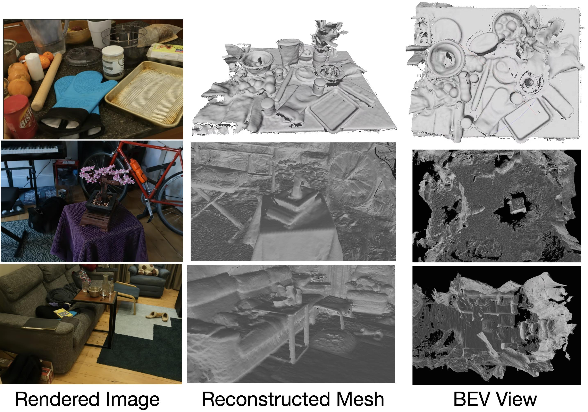

# 2DGS implementation based on GauStudio [beta version]


## Key Features

1. **Simplified 2D Geometry Shader (2DGS) Implementation**: We set the third scale component of 3DGS to 0, to achieve the desired 2D effect without the need for a custom rasterizer. This allows our system to be compatible with a wide range of 3DGS-enabled renderers, providing greater flexibility and ease of integration.

2. **Floater cleaning using simplified distortion loss**: We addresses the floater issues by minimizing the modified distortion loss, which is the gap between the median depth and the rendered depth

3. **Streamlined Mesh Reconstruction with GauStudio**


## Install
```
# Install GauStudio for training and mesh extraction
%cd /content
!rm -r /content/gaustudio
!pip install pip install -q plyfile torch torchvision tqdm opencv-python-headless omegaconf einops kiui scipy pycolmap==0.4.0 vdbfusion kornia trimesh
!git clone --recursive https://github.com/GAP-LAB-CUHK-SZ/gaustudio.git
%cd gaustudio/submodules/gaustudio-diff-gaussian-rasterization
!python setup.py install
%cd ../../
!python setup.py develop
```

## How to Use
```
# 2DGS training
pythont train.py -s <path to data> -m output/trained_result
# naive 2DGS training without extra regularization
python train.py -s <path to data>  -m output/trained_result --lambda_normal_consistency 0. --lambda_depth_distortion 0.
```
The results will be saved in `output/trained_result/point_cloud/iteration_{xxxx}/point_cloud.ply`. 

## Mesh Extraction
```
gs-extract-mesh -m output/trained_result -o output/trained_result
```

# License
This project is licensed under the Gaussian-Splatting License - see the LICENSE file for details.